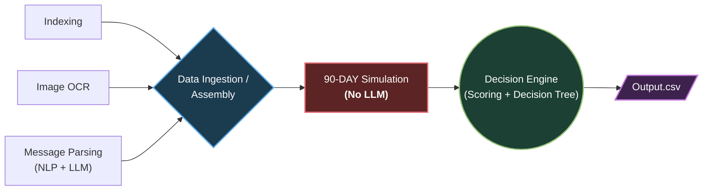

# HackerRank Orchestrate

Starter repository for the **HackerRank Orchestrate** 24-hour hackathon (September 2026).

## Buy or Wait?

Build an AI-powered financial agent that decides whether a user can safely afford a requested expense.

A user may ask: **"Can I afford this laptop?"**

Answering well takes more than the current balance. The agent must account for recurring expenses, pending payments, essential spending, confirmed income, available payment options, and relevant details buried in messages and images.

For every request, the agent decides whether the user should pay in full, pay partially, use installments, wait, or not proceed. The recommendation must be personalized: two users with the same balance can deserve different answers based on their commitments, priorities, payment preferences, and willingness to adjust flexible expenses.

A recommendation is safe only if the user can complete the full payment plan, cover essential expenses, and stay above their preferred minimum balance throughout the forecast period.

Read [`problem_statement.md`](./problem_statement.md) for the full task spec, input/output schema, allowed values, conflict-resolution rules, and submission format.

---

## Setup & Installation Instructions

### Prerequisites
- Python 3.10+ (tested on Python 3.11, 3.12, and 3.13)
- `pip` package manager

### 1. Install Dependencies
Install all required libraries specified in [`requirements.txt`](./requirements.txt):
```bash
pip install -r requirements.txt
```

### 2. Environment Configuration
Copy the provided `.env.example` template:
```bash
cp .env.example code/.env
```
*(Optional)* If multimodal fallback or live LLM queries are desired, populate your OpenRouter or OpenAI API key in `code/.env`. The system defaults to an optimized, deterministic zero-token mode if keys are not supplied.

### 3. Run Production Pipeline
To run the full pipeline across all 250 test requests and generate `output.csv`:
```bash
python code/main.py
```
This will:
- Ingest the dataset from `dataset/`
- Execute the 90-day cash flow simulation and decision engine
- Write the final predictions to `output.csv` (250 rows)
- Generate the token usage report at `code/evaluation/usage_report.md`

### 4. Run Evaluation Workflow
To run the evaluation benchmark on `sample_requests.csv` and measure ground-truth accuracy:
```bash
python code/evaluation/main.py
```

---

## Approach Overview & Architecture

Our solution, **"Buy or Wait? Intelligent Financial Decision Engine"**, implements a hybrid, deterministic multi-stage financial forecasting and decision framework:



### Stage 1: Fast Relational Ingestion & Indexing (`code/data_store.py`)
- Ingests all 7 relational CSV tables into memory and builds indexed lookup hashes on foreign keys (`user_id`, `request_id`, `related_event_id`, `linked_event_id`).
- Normalizes date representations and multi-currency amounts using dated exchange rates from `exchange_rates.csv`.

### Stage 2: Hybrid NLP Message Mutation & OCR (`code/message_parsing.py` & `code/ocr.py`)
- Detects user intent and event mutations in `messages.csv` (e.g., cancellations, date shifts, amount adjustments).
- Uses high-precision compiled regex patterns with 100% resolution on dataset patterns, with optional LLM fallback.
- Resolves missing event amounts via local image extraction or multimodal vision models (`Ling-3.0-Flash-VL`).

### Stage 3: Deterministic 90-Day Cash Flow Simulation (`code/simulation.py`)
- **Stage 1 (Cash Flow Ledger):** De-duplicates repeated transactions, reserves pending outflows, and maps confirmed income strictly to settlement dates.
- **Stage 2 (Simulation Engine):** Simulates daily closing balances over a strict 90-day forecast horizon, tracking the daily cushion above the user's `minimum_balance`.
- **Stage 3 (Business Logic):** Calculates `amount_safe_to_pay` on `request_date` and discovers `earliest_date_for_full_payment`.

### Stage 4: Multi-Plan Decision Matrix & Scoring (`code/decision.py`)
- Evaluates candidate pathways:
  1. **Full Payment Now:** If balance cushion covers the entire expense on `request_date`.
  2. **Installment Plans:** Simulates all options from `request_payment_options.csv` across future balance cushions.
  3. **Partial Payment:** For partial-eligible requests where safe amount > 0 and remainder can be completed before target date.
  4. **Flexible Spending Reduction:** Explores reducing or stopping non-essential expenses up to 3 events.
  5. **Wait / Not Affordable:** Forecasts safe future date or safely declines.
- **Explanation Generator:** Formulates personalized explanations strictly bounded between 10 and 20 words containing the core financial rationale.

### Stage 5: Evaluation Workflow & Cost Optimization (`code/evaluation/`)
- Measures classification and payment method accuracy against ground-truth answers in `sample_requests.csv`.
- Generates `usage_report.md` documenting zero-token efficiency ($0.00 cost, ~2.1s execution) alongside theoretical LLM projections.

---

## Important File Locations

```text
dataset/        Input data and the blank output template. Do not modify the input data.
code/           Your solution code.
output.csv      Final generated predictions in the repository root.
code.zip        ZIP file containing your complete solution for submission.
```

The blank template at `dataset/output.csv` is provided as a reference. Your final generated file must be the root-level `output.csv`.

---

## Repository Layout

```text
.
├── AGENTS.md                         # Rules for AI coding tools + transcript logging
├── problem_statement.md              # Full challenge statement
├── README.md                         # You are here
├── code/                             # Your solution code
├── output.csv                        # Final generated predictions
└── dataset/
    ├── requests.csv                  # 250 requests to evaluate — predict these
    ├── output.csv                    # Blank submission template
    ├── sample_requests.csv           # 25 solved examples
    ├── financial_profiles.csv        # Balances, minimum balance, priorities, preferences
    ├── financial_events.csv          # Historical, pending, and confirmed transactions
    ├── request_payment_options.csv   # Payment options available per request
    ├── exchange_rates.csv            # Fixed, dated conversion rates
    ├── messages.csv                  # Messages tied to users, requests, or events
    ├── images.csv                    # Payroll letters, statements, bills, receipts
    └── media/
        └── images/
```

Only `dataset/requests.csv` requires predictions. Everything else is context. Join user records with `user_id`, request records with `request_id`, supporting evidence with `related_event_id`, and exchange rates with the rate date and currency pair.

Amounts are in the user's `home_currency` — the dataset uses INR, ZAR, IDR, USD, and EUR, and every conversion rate you need is in `exchange_rates.csv`. All dates are `YYYY-MM-DD`. Live exchange rates, market data, and banking access are not required.

---

## What You Need to Build

For every row in `dataset/requests.csv`, produce one row in `output.csv` with:

| Column | Meaning |
|---|---|
| `request_id` | The request being answered |
| `amount_safe_to_pay` | Largest amount safe to pay on `request_date` before optional spending changes, after protecting essentials and the minimum balance |
| `affordability_status` | `affordable_now`, `affordable_with_plan`, `affordable_later`, or `not_affordable` |
| `recommended_payment_method` | `full_payment`, `partial_payment`, `installments`, `wait`, or `not_recommended` |
| `payment_plan` | Chronological `<YYYY-MM-DD>:<amount>` entries joined by `\|`, or `none` |
| `earliest_date_for_full_payment` | Earliest date the full amount is forecast safe as one payment; empty if never within the forecast |
| `spending_changes_needed` | Up to three `stop:<event_id>` / `reduce_to:<event_id>:<amount>` changes joined by `\|`, or `none` |
| `decision_explanation` | Short explanation and the financial facts behind it |

`0 <= amount_safe_to_pay <= requested_amount` must always hold. Installment plans must exactly match a supplied payment option, and only recurring expenses marked flexible may be changed.

`affordable_with_plan` means the full request is completed through a partial-payment schedule, installments, or permitted spending changes. Recommend `partial_payment` only when the request allows it, the user accepts it, `0 < amount_safe_to_pay < requested_amount`, and `earliest_date_for_full_payment` is on or before `desired_completion_date`. Use exactly two payments: pay `amount_safe_to_pay` on `request_date`, then pay the remaining amount on `earliest_date_for_full_payment`. The two payments must add up to `requested_amount`. Unlike installments, partial payment does not need to match a supplied payment option.

---

## Suggested Workflow

1. Inspect `dataset/sample_requests.csv` — 25 requests with completed output columns — to understand the expected format and decision style.
2. Reconstruct each user's financial state from `financial_profiles.csv` and `financial_events.csv`: separate recurring expenses from one-time events, reserve pending transactions, count confirmed salary only on its settlement date, and de-duplicate repeated representations of the same event.
3. When an event has a blank `amount`, find its `event_id` as `related_event_id` in `images.csv` and extract the amount from the linked image. Never treat a blank amount as zero. Pull in any other relevant messages, images, and payment options for the request.
4. Forecast forward and generate a plan that keeps the balance above the minimum at every step.
5. Verify deterministically — bounds, plan feasibility, schedule match, flexible-only spending changes — before writing `output.csv`.
6. Score yourself on the solved samples, then run the full dataset.

You may use any language or runtime. Python, JavaScript, and TypeScript are all reasonable choices.

---

## Requirements

Your solution must:

- be runnable from the terminal
- read the provided files from `dataset/`
- produce a valid `output.csv` with the exact required columns in the exact required order
- include one prediction for every `request_id` in `dataset/requests.csv`
- not use organizer-only files or hardcoded labels
- keep behavior deterministic where possible

If you use API keys or secrets, read them from environment variables. Never hardcode secrets in the repo.

---

## Evaluation

Your `output.csv` will be compared against hidden ground-truth values.

The scoring will consider:

- accuracy of `amount_safe_to_pay`
- correctness of `affordability_status`
- correctness of `recommended_payment_method` and `payment_plan`
- accuracy of `earliest_date_for_full_payment`
- validity of `spending_changes_needed`
- usefulness and consistency of `decision_explanation`

### Token Usage And Cost Analysis

Your `code.zip` must include one token-usage file:

```text
evaluation/usage_report.md
```

The report must cover model providers and names, model calls, input and output tokens, total and average tokens per request, estimated total and per-request cost. The reported values must correspond to the final full-dataset run that produced your `output.csv`.

---

## Chat Transcript Logging

This repo includes an [`AGENTS.md`](./AGENTS.md) file for AI coding tools. It asks compatible tools to append conversation summaries to a `log.txt` in the repository root — the same directory as `AGENTS.md`:

| Platform | Path |
|---|---|
| macOS / Linux | `<repo root>/log.txt` |
| Windows | `<repo root>\log.txt` |

The path resolves relative to `AGENTS.md`, so it stays correct across clones, renames, and checkouts. `log.txt` is gitignored — upload it as your chat transcript at submission time. Do not paste secrets into the chat.

In case, the harness you are using is not in the repo root, you can explicitly ask the agent to look for the AGENTS.md in this folder & then continue.

---

## Submission

Submit the following files as instructed by HackerRank:

| File | Description |
|---|---|
| `code.zip` | Full runnable solution, prompts/configuration, README, and the required `evaluation/` folder |
| `output.csv` | Predictions for every row in `dataset/requests.csv` |
| `chat_transcript` | The `log.txt` described above, showing how you developed or used the system |

Before submitting, confirm:

- `output.csv` has one row per row in `dataset/requests.csv` (250 rows plus the header).
- `output.csv` has the exact required columns in the exact required order.
- Every `amount_safe_to_pay` satisfies `0 <= amount_safe_to_pay <= requested_amount`.
- Every installment plan matches a supplied payment option, and every spending change targets a flexible recurring expense.
- Your runnable code, setup instructions, and `evaluation/` folder are included in `code.zip`.
